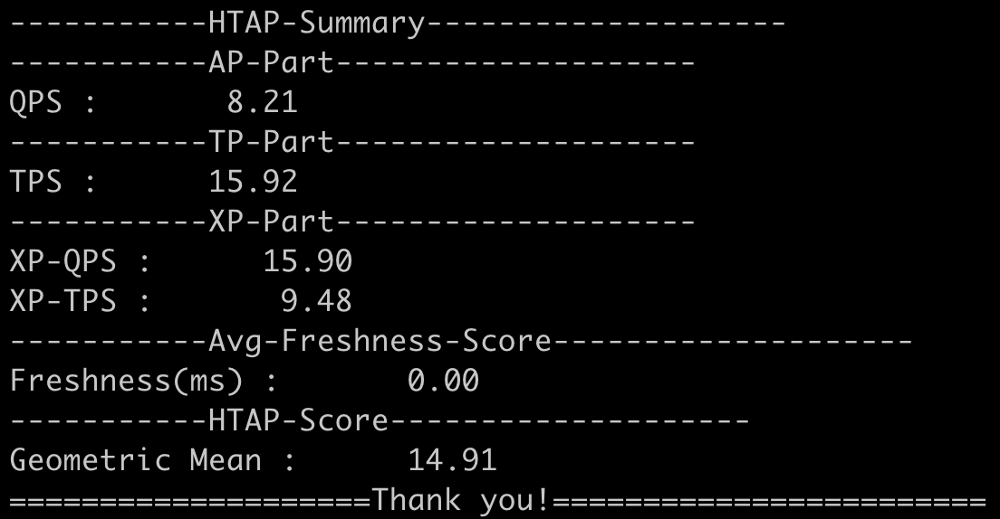

## Pixels-Benchmark - A general method for testing CDC synchronization throughput and freshness.

## Software Environments
```
MAVEN version >= 3.6.3

JAVA version >= 17

Tested OS: |Ubuntu 22.04|

```

## Benchmark Configuration

Configure the parameters for PostgreSQL 16 including **username, password** in the following file:

```
cd pixels-benchmark
vim ./conf/pg.props
```

docker image `quay.io/debezium/postgres:16` is recommended.


## Step 1: Data Generation and Loading [PostgreSQL 16]


```bash
psql -h localhost -U postgres -c 'create database pixels_bench_sf1x;'

./pixels_bench -t sql -c conf/pg.props -f conf/ddl_pg.sql

./pixels_bench -t gendata -c conf/pg.props -f conf/stmt_postgres.toml

psql -h localhost -U postgres -d pixels_bench_sf1x -f conf/load_data_pg.sql
```

Use `-r` option to enable freshness metric. In pixels bench, we need to init freshness table in a separate step

```bash
./pixels_bench -t runinitfresh  -c conf/pg.props -f conf/stmt_postgres.toml -r
```

## Step 2: Index Building [PostgreSQL 16]

```
./pixels_bench -t sql -c conf/pg.props -f conf/create_index_pg.sql
```

## Step 3: Run the Benchmark [PostgreSQL 16]

```
./pixels_bench -t runall -c conf/pg.props -f conf/stmt_postgres.toml
```

## Performance Metrics


## Benchmarking Notes
(1) Error: Could not find or load main class io.pixelsdb.HyBench
```
Solution: modify the path to lib directory in the hybench file
```

(2) mvn clean package...Failed to execute goal on project HyBench:HyBench:jar:1.0-SNAPSHOT
```
Solution: when the Maven version is greater than 3.8, you need to remove the tags of blocked mirrors of $Maven_home/conf/settings.xml. 
```

(3) With the OS in Windows, you may use the Java command to run HyBench: 
```
Solution: java -cp "HyBench-1.0-SNAPSHOT.jar;lib/*" io.pixelsdb.HyBench [-t][-c][-f]
```
(4) File not Found for PG data loading
```
Solution: modify the path to data directory in the conf/load_data_pg.sql file. For instance, replace 'Data_1x/customer.csv' with 'Data_10x/customer.csv'
```

(5) java.util.concurrent.ExecutionException: java.lang.NullPointerException: Cannot invoke "java.util.List.size()" because "this.Related_Blocked_Checking_ids" is null

```
Solution: make sure the data directory is under the working path and contains two files: 'Related_checking_bids' with Related_transfer_bids'
```

(6) Fail to generate data
```
make sure the user has the write permission to the folder or use the sudo command: sudo bash hybench -t gendata -c conf/pg.props -f conf/stmt_postgres.toml
```

(7) Benchmarking Parameters

### Parameter List

| Name            | Default                                       | Description                                                                                  | Comments                                      |   |
|----------------|-------------------------------------------|----------------------------------------------------------------------------------------|------------------------------------------|---|
| db             | postgres                                     | System Under Test      |                      |   |
| classname      | org.postgresql.Driver                     | TP JDBC Driver                                                                 |                                          |   |
| username       | xxx                                       | TP username                                                                           |                                          |   |
| password       | xxx                                       |TP password                                                                            |                                          |   |
| url            | jdbc:postgresql://localhost:5433/hybench_sf1x | TP JDBC URL                                          |                                          |   |
| url_ap         | jdbc:postgresql://localhost:5433/hybench_sf1x | AP JDBC URL                                         |                                          |   |
| classname_ap   | org.postgresql.Driver                    |  AP JDBC Driver                                                                    |                                          |   |
| username_ap    | xxx                                       | AP username                                                                            |                                          |   |
| password_ap    | xxx                                       | AP password                                                                            |                                          |   |
| sf             | 1x                                        | scale factor: 1x、10x、100x。                                                       |  |   |
| at1_percent    | 35                                        | AT1 ratio                                              | sum= 100%        |   |
| at2_percent    | 25                                        | AT2 ratio                                                   | sum= 100%          |   |
| at3_percent    | 15                                        | AT3 ratio                                                | sum= 100%          |   |
| at4_percent    | 15                                        | AT4 ratio                                                 | sum= 100%          |   |
| at5_percent    | 7                                         | AT5 ratio                                                  | sum= 100%          |   |
| at6_percent    | 3                                         | AT6 ratio                                                 | sum= 100%          |   |
| apclient       | 1                                         | AP concurrency                                             |                                          |   |
| tpclient       | 1                                         | TP concurrency                                                 |                                          |   |
| fresh_interval | 20                                        | If xpRunMins is set to 1 min，then the freshne evaluation is performed every 60/20=3 seconds  |                                          |   |
| apRunMins      | 1                                         | AP evaluation time                                                                            |                                          |   |
| tpRunMins      | 1                                         | TP evaluation time                                                                              |                                          |   |
| xpRunMins      | 1                                         | XP evaluation time                                                                             |                                          |   |
| xtpclient      | 1                                         | XP-ATS concurrency                                                             |                                          |   |
| xapclient      | 1                                         | XP-IQS concurrency                                                                |                                          |   |
| apround        | 1                                         | AP round，at least 1 round should be evaluated                                                                | AP Power test                      |   |

(9) Please refer to [parameters.toml](https://github.com/Rucchao/HyBench-2023/blob/master/src/main/resources/parameters.toml) for the parameters of data generation.

---

This repository is derived from the [HyBench](https://github.com/Rucchao/HyBench-2024) benchmark
and draws inspiration from the [HATtrick](https://github.com/UWHustle/HATtrick) approach.

